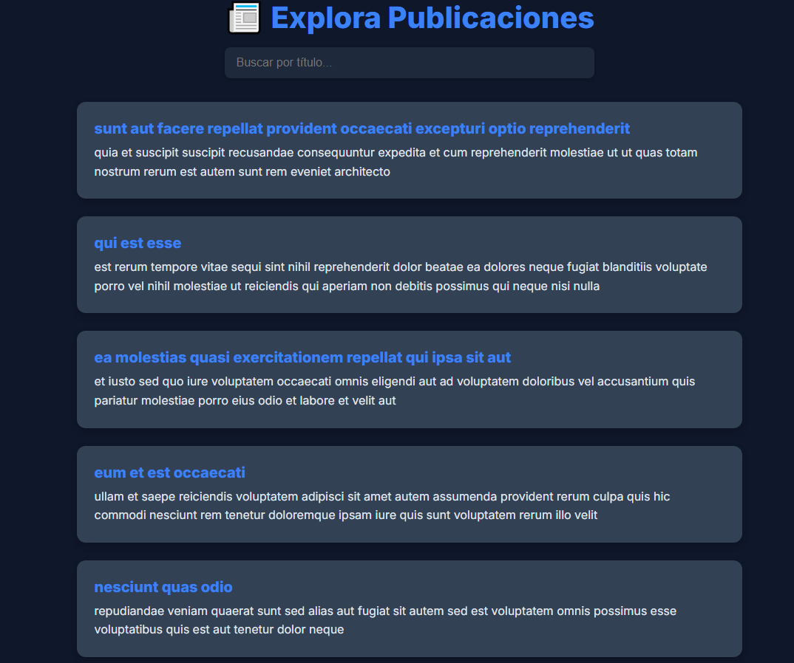

# Posts_5IGSolutions

Este repositorio contiene la solución completa a la prueba técnica de 5IG Solutions, desarrollada en 4 fases que integran modelado de base de datos, API REST, desarrollo Front-End moderno y despliegue automatizado usando GitHub Actions.

---

## DEMOS DEL PROYECTO

- **GitHub Pages** (entorno solicitado):  
  [https://pipepena2979.github.io/Posts_5IGSolutions](https://pipepena2979.github.io/Posts_5IGSolutions)

- **Netlify (entorno productivo agregado como valor adicional):**  
  [https://posts-5igsolutions.netlify.app](https://posts-5igsolutions.netlify.app)

> El sitio fue alojado en GitHub Pages como requerimiento, pero también fue desplegado en **Netlify**, una plataforma profesional de hosting con CDN integrado, para mejorar el tiempo de carga y simular un entorno de producción real. Esta decisión representa un aporte estratégico y diferencial en la entrega final.

---

---

## VISTA PREVIA DEL SITIO

  

---

## ESTRUCTURA DE TAREAS

### Tarea 1: Modelado y Base de Datos
- Diagrama E-R del sistema de publicaciones.
- Script SQL con estructura de tablas, relaciones y claves foráneas.
- Modelado pensado para escalabilidad y coherencia lógica.

### Tarea 2: API REST con Python
- API funcional creada con `http.server`.
- CRUD básico usando archivos JSON como base de datos.
- Endpoints:
  - `GET /posts`
  - `POST /posts`
- Código comentado y optimizado, ideal para entornos educativos o pruebas técnicas sin frameworks.

### Tarea 3: Aplicación Front-End
- Página web responsive con HTML5, CSS3 y JavaScript puro.
- Diseño moderno y profesional (UI/UX).
- **Paginación dinámica** integrada.
- Estructura modular y fácil de escalar.
- Logo, favicon y recursos gráficos personalizados.
- Extra: se añadió animación ligera y fuentes optimizadas vía Google Fonts.

### Tarea 4: CI/CD con GitHub Actions
- Archivo `deploy.yml` con pipeline funcional.
- Flujo automatizado que:
  - Ejecuta validaciones
  - Sube artefactos
  - Despliega en GitHub Pages al hacer push a `main`
- Acciones usadas:
  - `actions/checkout@v3`
  - `actions/upload-pages-artifact@v3`
  - `actions/configure-pages@v4`
  - `actions/deploy-pages@v4`
- Permisos correctamente configurados: `pages: write`, `id-token: write`

---

## TECNOLOGÍAS UTILIZADAS

- **HTML5 / CSS3 / JavaScript**
- **Python 3**
- **GitHub Pages**
- **Netlify**
- **GitHub Actions (CI/CD)**

---

## VALORES DIFERENCIALES

- ✅ Aplicación 100% funcional y completa
- ✅ Entrega visualmente atractiva
- ✅ Automatización avanzada sin usar herramientas externas
- ✅ Documentación clara, limpia y orientada a buenas prácticas
- ✅ Plus: Hosting en Netlify como entorno de producción real

---

## AUTOR

**Andrés Felipe Peña Castro**  
Desarrollador de Software | Apasionado por el diseño, la automatización y la excelencia en entregas  
🔗 [GitHub](https://github.com/Pipepena2979)  
🔗 [LinkedIn](https://www.linkedin.com/in/pipepenadev/)

---
